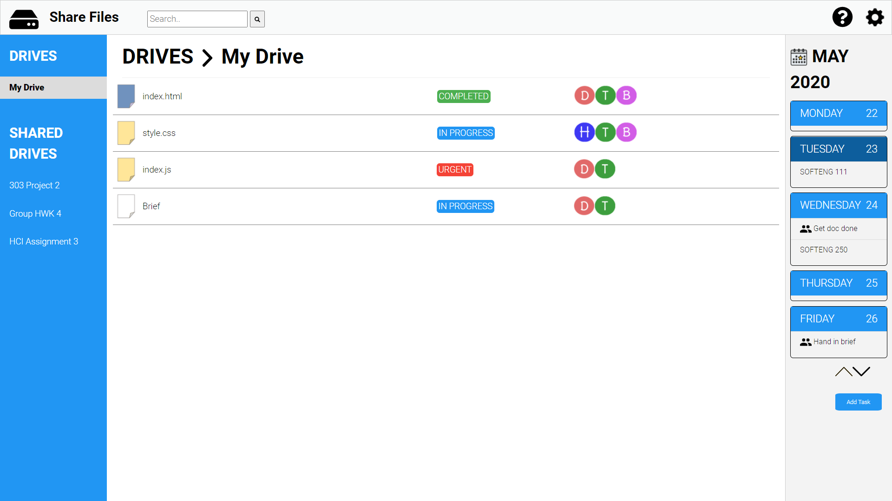

# SOFTENG350-A3: Group 10

This project was for the purposes of designing the user interface for a file sharing web application similar to google drive and drop box. The main focus was on UX design.

This project consisted of a domain familiarisation and user needs analysis. Then after the implementation of our first prototype, we performed usage testing with two candidate and formulised the results.

All information can be found with the report.

Open index.html in a browser that supports Javascript to start our prototype. Preferably Chrome.

### Webpage Icons
Please see the References section in our report for a full list of icon sources.

### Prototype Resolution
The preferred resolution size for viewing our high-fidelity prototype is **1920x1080**; the screen used
to develop the prototype was relatively large so please zoom out to see the full aethestic appeal of
the webpage.

### References

#### External Sources

W3 CSS: https://www.w3schools.com/w3css/default.asp
jQuery: https://jquery.com/
Roboto Font: https://fonts.google.com/specimen/Roboto

#### Icons

File icons were adapted from the Assignment 3 Base provided by the SOFTENG 350 course.

HDD: https://fontawesome.com/icons/hdd?style=solid
Search bar: https://fontawesome.com/icons/search?style=solid
Settings COG: https://thenounproject.com/search/?q=cog&i=45864
Question Mark (circle): https://fontawesome.com/icons/question-circle?style=solid
Circle Check for Share Success: https://fontawesome.com/icons/check-circle?style=solid
Calendar Icon: https://www.flaticon.com/free-icon/event_2413421
Calendar Down Arrow: https://www.flaticon.com/free-icon/down-arrow_318426?term=down%20arrow&page=1&position=9 
Calendar Up Arrow: https://www.flaticon.com/free-icon/up-arrow_892555?term=up%20arrow&page=1&position=7
Calendar Collaboration Icon: https://www.flaticon.com/free-icon/two-men_60692?term=two%20people&page=1&position=24
